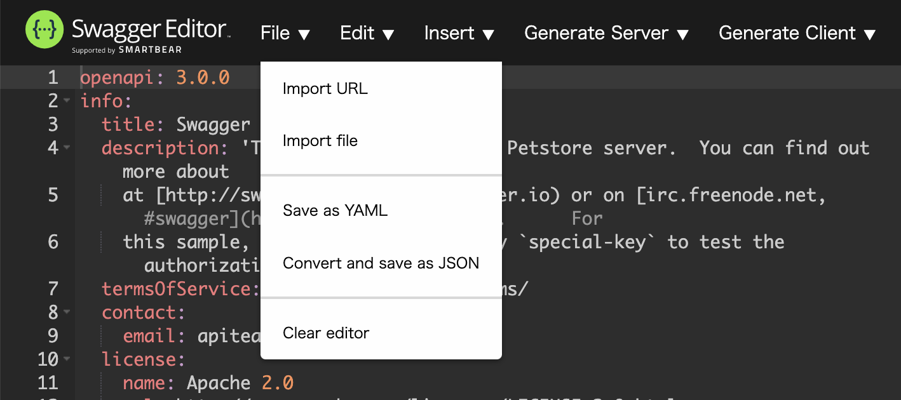

# Swaggerまとめ

---

## 概要

### SwaggerSpec(OpenAPISpec)

APIの仕様書。YamlもしくはJSONで記述する。この仕様書をもとにAPIやフロントエンドの開発を進めていく。

### SwaggerEditor

https://swagger.io/tools/swagger-editor

SwaggerSpecを書くのに便利なエディタ。プレビューでSwaggerUIを表示してくれる。

### SwaggerUI

https://swagger.io/tools/swagger-ui

SwaggerSpecで書いた仕様書を元にHTML形式でドキュメント化してくれる。

### SwaggerCodegen

https://swagger.io/tools/swagger-codegen/

SwaggerSpecで書いた定義をもとに、クライアント/サーバコードを自動生成するツール。

### Prism

SwaggerSpecで書いた定義を食わせてモックサーバーを立ててくれるツール。

---

## SwaggerSpec

Swagger(OpenAPI)ドキュメント。Yaml(もしくはJSON)でSwaggerObject(OpenAPIObject)を定義する。実用的な話をすると、こんな説明を聞くより公式のサンプルをコピペすればなんとなくわかるので、必要なところを書き換える感じで誰でも書けます。
一応以下で雑に説明する。詳しくは [ここ](https://github.com/OAI/OpenAPI-Specification/tree/main/versions) からドキュメントを読もう。
Swagger2.0とOpenAPI3.0.0で使用感が大きく変わるのでどちらを使うかは要相談。

---

## SwaggerEditor


左がエディタ、右がUIのプレビューになっており、上にメニューバーがついている。



- Import URL
  - URLからインポートする(YAML or JSON)
- Import file
  - 手元のファイルからインポートする(YAML or JSON)
- Save as YAML
  - YAMLファイルとしてダウンロードする
- Convert and save as JSON
  - JSONにコンバートしてJSONファイルをダウンロードする
- Clear editor
  - エディタの中身をまっさらな状態にする


- Convert to YAML
  - JSONをYAMLにコンバートする


フォームを入力し、対応するオブジェクトをOpenAPIオブジェクト内に挿入する。


現在のSwaggerSpecをもとに、サーバーのソースコードを自動生成する


現在のSwaggerSpecをもとに、クライアントのソースコードを自動生成する

## SwaggerUI


Editorのプレビューの内容と同じ。SwaggerSpecの内容がUIで確認しやすい。

---

## Prism

localhost:3003にモックサーバーを立てているので、実際にリクエストを送ってみる。

ポイントは `-H 'api_key: special-key'` を付けて認証を突破すること(`special-key`でなくとも認証は突破できる)


```zsh
rhiroe@RH1074 swagger_sample % curl -s -H 'api_key: special-key' -H "Accept: Application/json" localhost:3003/pet/0 | json_pp
{
   "category" : {
      "id" : -9.22337203685478e+18,
      "name" : "string"
   },
   "id" : -9.22337203685478e+18,
   "name" : "doggie",
   "photoUrls" : [
      "string"
   ],
   "status" : "available",
   "tags" : [
      {
         "id" : -9.22337203685478e+18,
         "name" : "string"
      }
   ]
}
```

ちなみに、`GET /pet/{petId}`のリクエストに`api_key`がいるぞというのはSwaggerSpecの
```
paths: > /pet/{petId}: > get: > security:
```
に書かれおり、ここでの`api_key`はSwagger2.0だと

```
securityDefinitions: > api_key:
```
OpenAPI3.0.0だと
```
components: > securitySchemes: > api_key:
```
にあたる。

